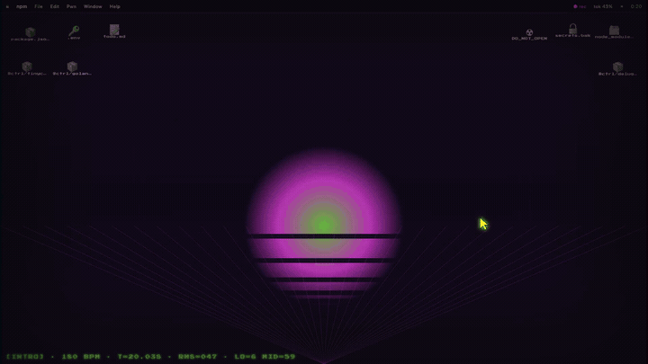

[](assets/install_me_coward.mp4)

# Shoggoth Interceptor

Tooling for working the Wildcat ZenHub Product Planning board down: rank the
open tickets, work one per loop through a Fiat delivery, store the deliverables
locally, exclude it, repeat. The loop protocol is in [CLAUDE.md](CLAUDE.md).

## Pieces

- `bin/shoggoth.py`: board reader with `fetch`, `fetch-pipelines`, `roster`,
  `show <n>`, `exclude <n> <reason>`, and `excluded` subcommands.
- `bin/console.py`: the operator console (see below).
- `bin/archive.sh`: rolling archive zip of scratchpads, deliverables, state.
- `bin/wildcat-gate.sh`: denies pushes and PRs to `wildcat-finance/*`
  (except `skills`) without the shoggoth gh credential recorded in
  `state/guardrails.json`.
- `bin/install-guardrails.sh`: installs the gate as a pre-push hook in a
  clone (its worktrees inherit it); part of every loop's clone step.
- `bin/shoggoth-pr.sh`: the only sanctioned PR path; runs the gate, then
  `gh pr create`.
- `bin/migration-check.sh`: disposable Docker-Postgres migration test that
  applies all Prisma migrations from zero and asserts they reproduce
  `schema.prisma`. Mandatory for any loop touching `prisma/`.
- `state/`: board cache, pipeline map, exclusion list.
- `deliverables/`: per-ticket outputs an operator attaches to issues by hand.
- `docs/console-study.md` and `docs/console-runbook.md`: the console's spec.

## Operator console

One local instance per operator:

```bash
python3 bin/console.py
```

Then open http://127.0.0.1:8737. The console shows the scoped roster (Icebox
and Product Backlog, tech debt first), rankings, ticket detail with comments,
deliverables, and the exclusion list, and can refresh the board, record an
exclusion, and cut an archive. It binds 127.0.0.1 only, reads credentials from
nothing (only `bin/shoggoth.py` touches `.env`), and never writes to GitHub or
ZenHub.

## Credentials each operator brings

- `.env` with `WILDCAT_ZENHUB_READ_ONLY_PAT` (GitHub fine-grained PAT, read
  access to `wildcat-finance/product`) and `ZENHUB_API_KEY` (ZenHub GraphQL
  personal key for the Product Planning workspace).
- A `gh` login with push access, used only by agent ticket loops, never by the
  console.

## Tests

```bash
python3 -m unittest discover -s tests
```
